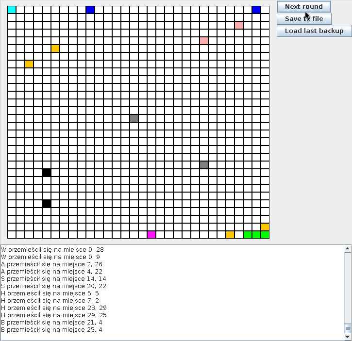
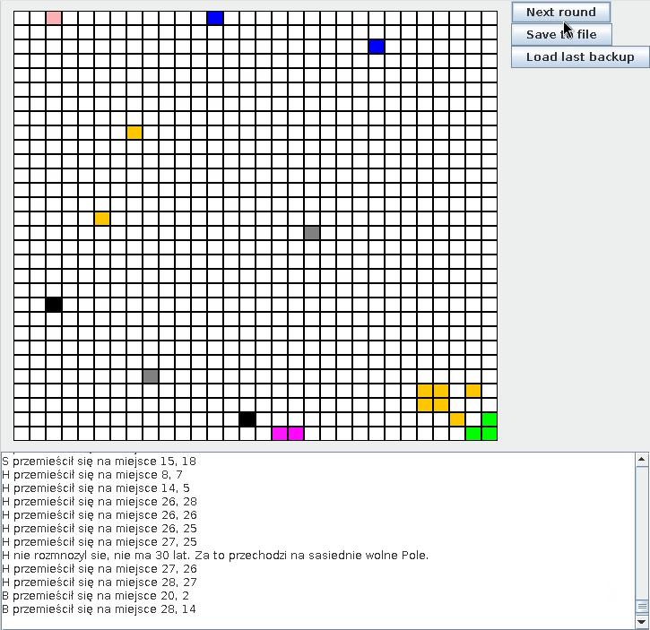

# 🌍 **_Digital_World_**

The purpose of this project is to create a digital world, which is a small game inhabited by animals and plants. In this world, animals can fight with other species and multiply within their own. Various plants can provide buffs or debuffs to the animals that consume them.

This project was created entirely in Java and served as my first introduction to both the language and the concepts of object-oriented programming.

A key feature is the ability for the user to save the current state of the world—including all animal statistics and positions—to a text file, allowing them to resume their simulation at a later time.

---

### ⚡Digital Dashboard



- ⚔️ **Fighting with other species:** The GIF above shows a fight between a wolf and a sheep.
- 📜 **Logs:** The log at the bottom of the window provides real-time updates on all actions occurring on the board.



- 🐣 **Reproduction:** When an animal collides with another of the same species, they attempt to reproduce.
- 🌱 **Plant Growth:** Each turn, plants have a chance to spread to a random adjacent tile.
- 🍽️ **Collision with Plants:** Colliding with a plant triggers a unique effect depending on the plant's type.

---

### 🛠️ Features

- 🔄 **Dynamic Simulation:** A turn-based world where organisms can move, interact, and evolve.
- 🐾 **Diverse Organisms:** The world is populated with various species of animals and plants.
- ⚔️ **Combat & Reproduction:** Animals can engage in combat with different species and reproduce with members of their own kind.
- ✨ **Buffs & Debuffs:** Plants can be consumed by animals to gain special advantages or suffer penalties.
- 💾 **Save/Load System:** The entire state of the simulation can be saved to a file and loaded later.

### 🌳 The Inhabitants of the World

Our digital world is currently home to the following species:

#### Animals

- 🐺 **Wolf:** A natural predator of the ecosystem.
- 🐑 **Sheep:** A common prey animal.
- 🐗 **Boar:** A tough and resilient animal.
- 🐐 **Antelope:** A fast-moving creature.
- 🦔 **Hedgehog:** A small, defensive animal.

#### Plants

- 🌱 **Grass:** Basic vegetation, likely serves as a primary food source.
- 🌿 **Guarane:** (Guarana) A special plant that provides a strength boost.
- 🫐 **Wolfberries:** A poisonous plant that is fatal when consumed.

### ⚙️ How It Works: Core Mechanics

The simulation operates on a turn-based system where actions are resolved in order of each organism's `initiative` value. Here are the core concepts that govern the world:

#### 1. Core Attributes

Every organism in the world is defined by a set of key attributes:

- 💪 **Strength:** The primary statistic used in combat. An organism with higher strength will defeat an organism with lower strength.
- 🏃 **Initiative:** Determines the order of action in a turn. Organisms with higher initiative act first.
- ⏳ **Age:** Increases with each turn. It is a key factor for reproduction.
- 📍 **Position:** The (x, y) coordinates of the organism on the world grid.
- 😵 **Stun:** A temporary state where an organism cannot act for a set number of turns.

#### 2. Turn-Based Actions

In each turn, organisms perform an `action()`:

- 🐾 **Animals:** Move to a random, adjacent tile.
- 🌱 **Plants:** Have a small (2%) chance of spreading to an adjacent empty tile.

#### 3. Interactions & Collisions

When an animal moves onto a tile occupied by another organism, a `collision` occurs:

- 🐣 **Animal vs. Same Species Animal:** If both animals are old enough (age >= 30), they will reproduce, creating a new organism of their kind on a nearby empty tile.
- ⚔️ **Animal vs. Different Species Animal:** The two animals will `fight()`. The one with lower `strength` is killed and removed from the simulation.
  - 🛡️ **Hedgehog's Defense:** Any animal that attacks a Hedgehog (even if it wins) becomes stunned for 2 turns as a penalty.
- 🍽️ **Animal vs. Plant:** The animal attempts to eat the plant, triggering the plant's unique `collision` effect.

#### 4. Plant Effects (Buffs & Debuffs)

The true diversity of the world comes from its flora. Consuming a plant has a permanent effect:

- 🌾 **Grass:** Serves as basic food and is simply consumed with no special effect.
- ✨ **Guarane:** A beneficial plant. The consuming animal gains a permanent **+3 Strength** bonus.
- ☠️ **Wolfberries:** A poisonous plant. The consuming animal **dies instantly**.

---

### 🧑‍💻 Tech Stack & Design Patterns

This project, while being a first step into Java, intuitively utilizes several key technologies and design patterns that form its architecture.

- **Java & Java Swing**
  - **Description:** The core of the application is built using standard Java. The graphical user interface (GUI) is rendered using the Java Swing library, which provides components like `JFrame`, `JPanel`, and `JButton` to create the interactive window and grid.

- **Model-View-Controller (MVC) Pattern**
  - **Description:** The project's structure clearly separates responsibilities, following the MVC pattern.
    - **Model:** The `World` class and all `Organism` subclasses, which manage the game's state and business logic.
    - **View:** The `MainWindow` class, which is responsible only for visualizing the model's data (drawing the grid and logs).
    - **Controller:** The `ActionListener` within `MainWindow`, which handles user input (button clicks) and translates it into actions on the model (e.g., `world.makeRound()`).

- **Factory Pattern**
  - **Description:** This pattern is used for object creation. It's visible in two key places: the `clone()` method for reproduction, and the static `readFromFile()` method for loading a saved world. In both cases, new organisms (`Wolf`, `Sheep`, etc.) are created without the calling code needing to know the specific subclass.

- **Observer Pattern**
  - **Description:** A simple version of this pattern is used for logging. Game objects report events to the `World` (`addToMessage`). The `World` then notifies the `MainWindow` at the end of the turn, which updates the `JTextArea`. The game objects don't know about the GUI, they just report status.

- **Strategy Pattern**
  - **Description:** The `collision()` method is a prime example of this pattern. The default "collision strategy" in the base `Animal` class is to fight or multiply. However, this strategy is overridden in specific `Plant` subclasses (`Guarane`, `Wolfberries`) to produce a completely different outcome (apply a buff or cause death).

---

### 🚀 How to Run

To launch the **Digital World** simulation on your local machine, follow these steps:

1.  **Prerequisites:**
    - Ensure you have **Java (JDK 8 or newer)** installed.

2.  **Clone the Repository:**

    ```bash
    git clone git@github.com:X3raFin/Digital_World.git
    cd Digital_World
    ```

3.  **Compile and Run:**
    Compile the source code and run the application from the project root to ensure `start.txt` is loaded correctly.
    ```bash
    cd src
    javac App.java
    cd ..
    java -cp src App
    ```

---

## 📬 Contact

Created by **Kacper Jankowski**.

- 🌐 **LinkedIn:** [LinkedIn](https://www.linkedin.com/in/kacper-jankowski-webdev/)
- 📧 **Email:** kacper.jankowski.webdev@gmail.com
- 💼 **Portfolio:** [Portfolio](https://kacper-jan-webdev.vercel.app/)
